# FlowFocus

A task manager that only shows you one task at a time (whatever's' most important right now) so you don't have to decide what to do next.

## How to Run It Yourself

- Make sure you have [Node.js](https://nodejs.org/) installed
- Clone this repo
- Open a terminal in the `flow-focus` folder
- Run `npm install`
- Run `npm run dev`
- Open [http://localhost:5174](http://localhost:5174) in your browser

Your tasks are saved in your browser (via IndexedDB). No account or server is needed.

### Running it as part of the Local Web Apps hub

This repo can also live inside a bigger `local-web-apps` folder alongside other apps, which run together from one shared local server (the "hub") at `http://localhost:4200`.

This only works if you have that bigger folder set up, with a `hub` folder next to this `flow-focus` folder. If you only cloned this standalone `flow-focus` repo, you won't have the hub. Just use `npm run dev` above instead.

If you do have the hub set up:

- Run `npm run build`
- Start the hub (see `../hub/README.md`)
- Open [http://localhost:4200/flow-focus](http://localhost:4200/flow-focus)

On Windows, `launchers/start-flow-focus.bat` does both of these for you and opens the app in your browser. See `launchers/README.md`.

## Usage Examples

Here are a few examples of the things you can do in Flow Focus with screenshots.

### Creating a New Task

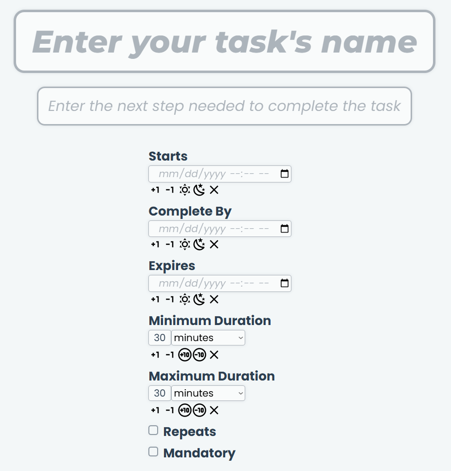

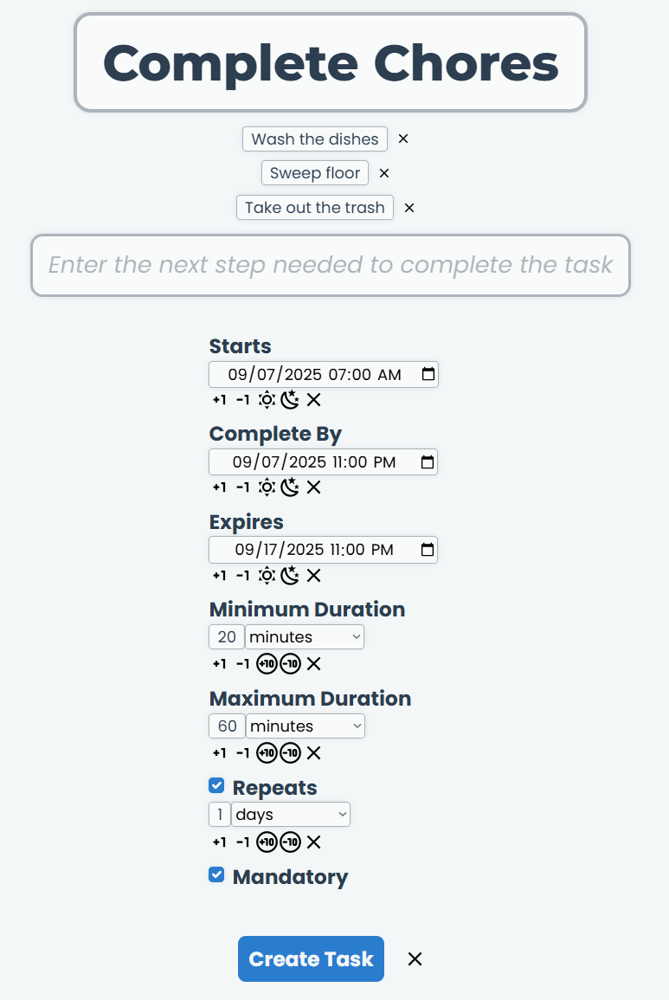

### Putting off a Task Until Later

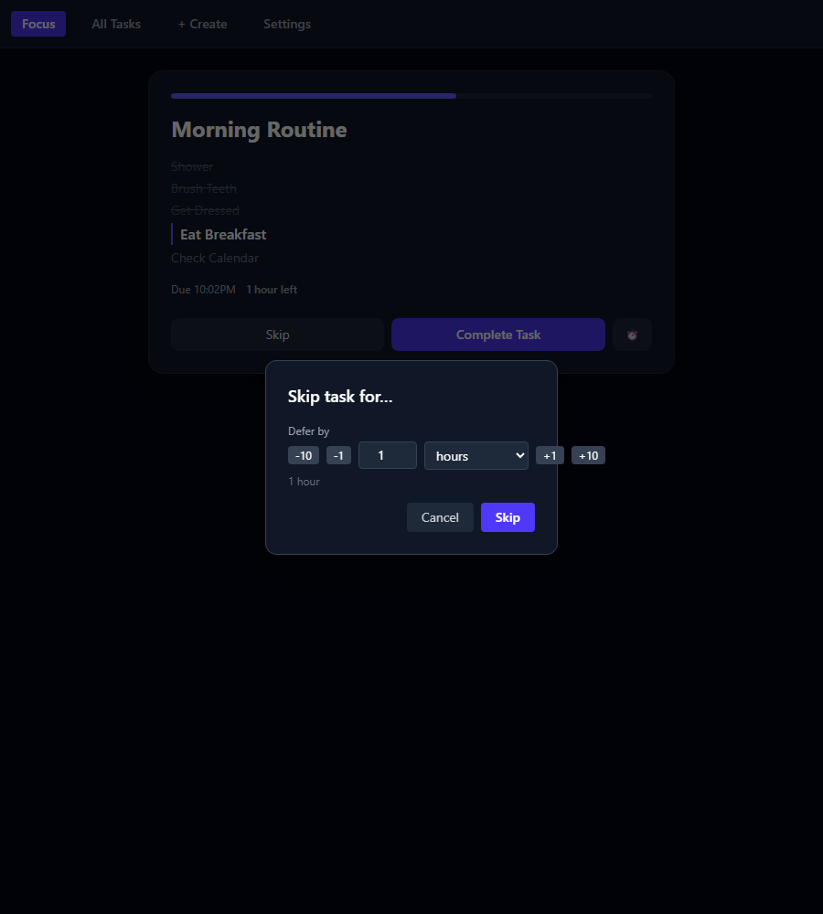

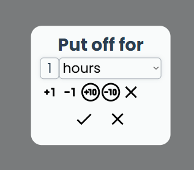

### Completing a Step of a Task

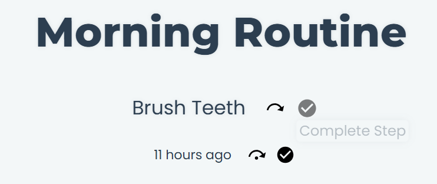

### Editing a Step of a Task

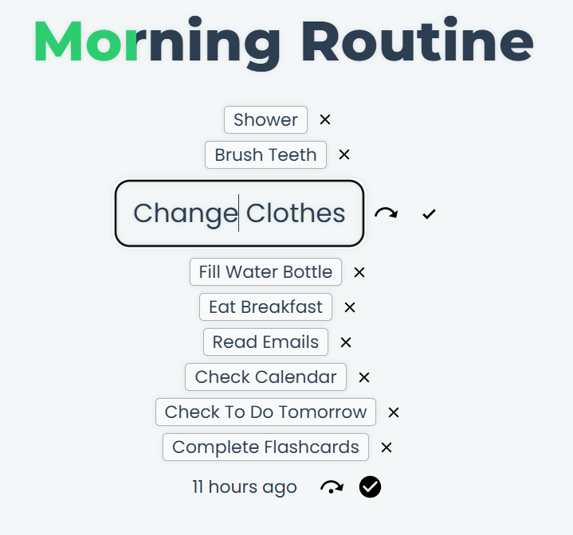

### Editing the Time of a Task

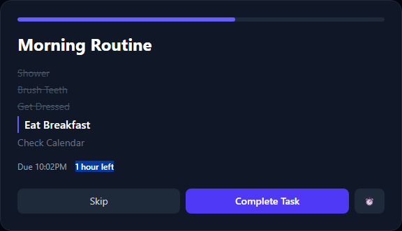

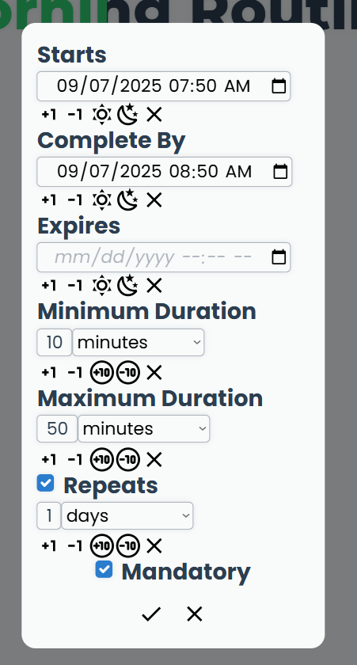

### Managing Your Tasks

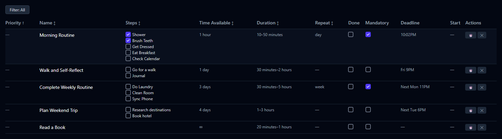

### Editing a Task in the Task Manager

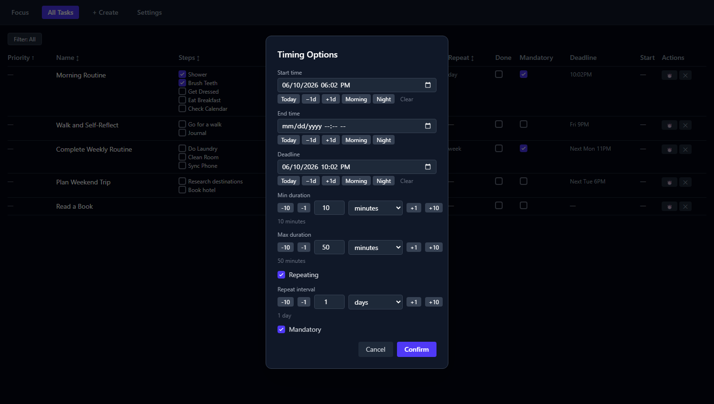

### Filtering Tasks By Completion Date As Today

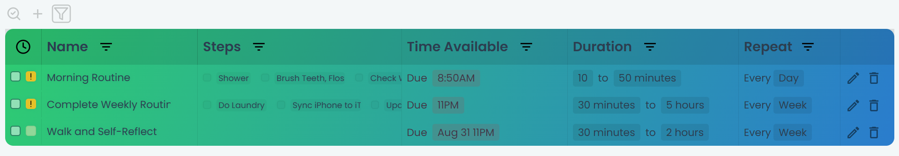

### Sorting Tasks By Name

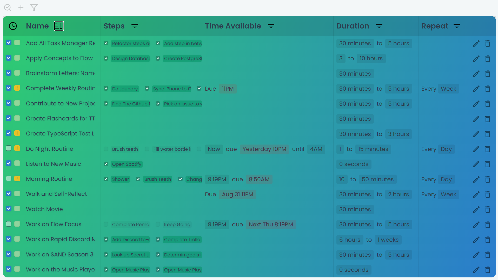

### Changing Time Shortcuts and Sleep Schedule Settings

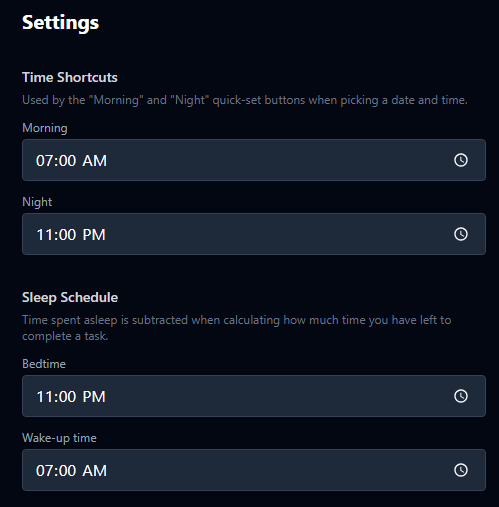

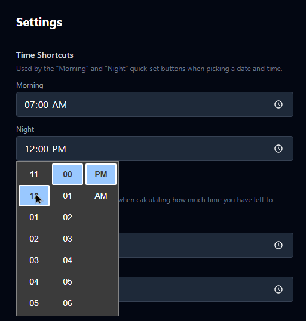

### Backing Up Your Data

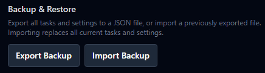

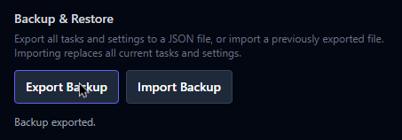

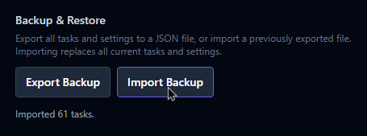
