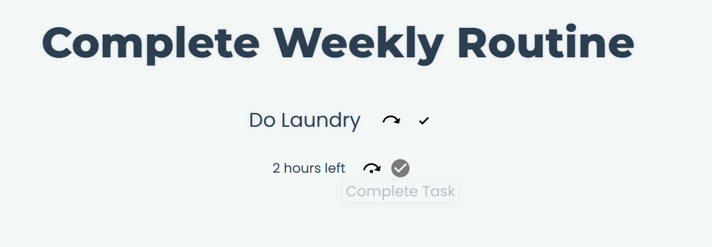
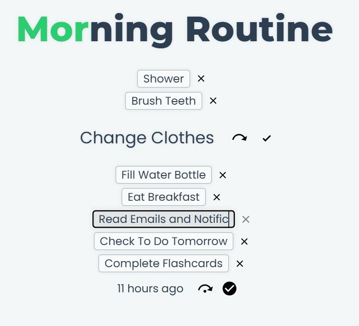
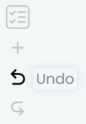
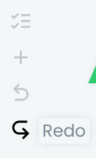

# FlowFocus

This project was generated with [Angular CLI](https://github.com/angular/angular-cli) version 18.0.7.

## To Run Developer Prototype

- Download project as a .zip file
- Unzip file into folder
- Run `start-app-dev-mode.sh` with Git Bash
- If it doesn't open automatically in your browser, go to [http://localhost:4200/flow-focus/](http://localhost:4200/flow-focus/)

## Usage Examples

Here are a few examples of the things you can do in Flow Focus with screenshots.

### Creating a New Task

### Completing a Task

### Putting off a Task Until Later

### Completing a Step of a Task

### Skipping a Step of a Task

### Editing a Step of a Task

### Editing the Time of a Task

### Manging Your Tasks

### Editing a Task in the Task Manager

### Filtering Tasks By Completion Date As Today

### Sorting Tasks By Name

### Undoing and Redoing Actions

